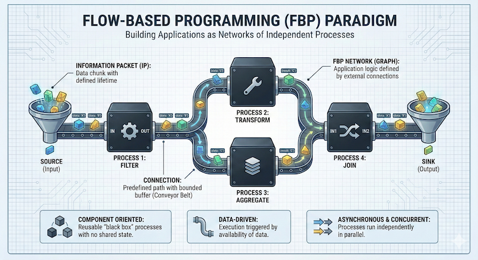

# Awesome Flow-Based Programming (FBP)

This is a community knowledge base for [flow-based programming (FBP)](https://grokipedia.com/page/Flow-based_programming).

 

[[Showcase](#showcase)] |
[[Reference](#reference)] |
[[Community](#community)]

## Showcase

| Project | Summary | Author | Language | License | Updated | Links |
| :------ | :------ | :----- | :------- | :------ | :------ | :---- |
| [Apache NiFi](https://github.com/apache/nifi) | Mature ETL workflow system based on FBP. | [@apache](https://github.com/apache) | Java | Apache | 2026 | [:octocat:](https://github.com/apache/nifi) [:house:](https://nifi.apache.org) |
| [Async-Flow](https://github.com/artob/async-flow) | Async FBP core abstractions for Tokio. | [@artob](https://github.com/artob) | Rust | Unlicense | 2026 | [:octocat:](https://github.com/artob/async-flow) [📦](https://crates.io/crates/async-flow) [:book:](https://docs.rs/async-flow) [:house:](https://async-flow.rs) |
| [CppFBP](https://github.com/jpaulm/cppfbp) | Classical FBP implementation for C++. | [@jpaulm](https://github.com/jpaulm) | C, C++ | Artistic | 2021 | [:octocat:](https://github.com/jpaulm/cppfbp) |
| [CsharpFBP](https://github.com/jpaulm/csharpfbp) | Classical FBP implementation for C#. | [@jpaulm](https://github.com/jpaulm) | C# | Artistic | 2021 | [:octocat:](https://github.com/jpaulm/csharpfbp) |
| [Flowex](https://github.com/antonmi/flowex) | FBP/ROP framework based on GenStage. | [@antonmi](https://github.com/antonmi) | Elixir | Apache | 2021 | [:octocat:](https://github.com/antonmi/flowex) [📦](https://hex.pm/packages/flowex) [:book:](https://hexdocs.pm/flowex) |
| [Flows.rs](https://github.com/artob/flows.rs) | Reusable FBP building blocks for Tokio. | [@artob](https://github.com/artob) | Rust | Unlicense | 2026 | [:octocat:](https://github.com/artob/flows.rs) [📦](https://crates.io/crates/flows) [:book:](https://docs.rs/flows) [:house:](https://flows.rs) |
| [GoFBP](https://github.com/jpaulm/gofbp) | Classical FBP implementation for Go. | [@jpaulm](https://github.com/jpaulm) | Go | Unknown | 2022 | [:octocat:](https://github.com/jpaulm/gofbp) |
| [JavaFBP](https://github.com/jpaulm/javafbp) | Classical FBP implementation for Java. | [@jpaulm](https://github.com/jpaulm) | Java | LGPL | 2022 | [:octocat:](https://github.com/jpaulm/javafbp) |
| [JSFBP](https://github.com/jpaulm/jsfbp) | Classical FBP implementation for JavaScript. | [@jpaulm](https://github.com/jpaulm) | JavaScript | MIT | 2021 | [:octocat:](https://github.com/jpaulm/jsfbp) |
| [Node-RED](https://github.com/node-red/node-red) | Popular low-code IDE for event-driven apps. | [@knolleary](https://github.com/knolleary) | JavaScript | Apache | 2026 | [:octocat:](https://github.com/node-red/node-red) [:house:](https://nodered.org) |
| [NoFlo](https://github.com/noflo/noflo) | Popular FBP-inspired runtime for Node.js. | [@bergie](https://github.com/bergie) | JavaScript | MIT | 2024 | [:octocat:](https://github.com/noflo/noflo) [:house:](https://noflojs.org) |
| [Protoflow](https://github.com/asimov-platform/protoflow) | Thread-based FBP using Protocol Buffers. | [@artob](https://github.com/artob) | Rust | Unlicense | 2025 | [:octocat:](https://github.com/asimov-platform/protoflow) [📦](https://crates.io/crates/protoflow) [:book:](https://docs.rs/protoflow) |
| [SciPipe](https://github.com/scipipe/scipipe) | Mature scientific workflow library for Go. | [@samuell](https://github.com/samuell) | Go | MIT | 2024 | [:octocat:](https://github.com/scipipe/scipipe) [:house:](https://scipipe.org) |

## Reference

This is a cross-reference between FBP implementations.

### Glossary

| [Classical FBP]         | [Flux Theory] | [Apache NiFi]   | [NoFlo]    | [Node-RED]    |
| :---------------------- | :------------ | :-------------- | :--------- | :------------ |
| Network                 | System        | Flow            | Graph      | Flow          |
| Subnet [^1]             | Subsystem     | Process Group   | Subgraph   | Subflow       |
| Component [^2]          | Block         | Processor       | Component  | Node          |
| Process [^3]            | Process       | Processor       | Process    | Node          |
| Connection [^4]         | Connection    | Connection      | Connection | Wire          |
| Port                    | Port          | Relationship    | Port       | Port          |
| Information Packet (IP) | Message       | Flow File       | IP         | Message       |
| Initial Information Packet (IIP) | Property      | -      | IIP        | Config Node   |
| Scheduler               | Scheduler     | Flow Controller | Runtime    | Runtime       |

[^1]: Subnets were also known as "composite components" in classical FBP.
[^2]: Components were described as "black boxes" in classical FBP.
[^3]: Processes were interchangeably called "threads" in classical FBP.
[^4]: Connections were also known as "bounded buffers" in classical FBP.

## Community

[@antonmi](https://github.com/antonmi),
[@apiri](https://github.com/apiri),
[@artob](https://github.com/artob),
[@bergie](https://github.com/bergie),
[@exceptionfactory](https://github.com/exceptionfactory),
[@joewitt](https://github.com/joewitt),
[@jpaulm](https://github.com/jpaulm),
[@knolleary](https://github.com/knolleary),
[@markap14](https://github.com/markap14),
[@mcgilman](https://github.com/mcgilman),
[@samuell](https://github.com/samuell)

---

[Classical FBP]: https://jpaulm.github.io/fbp/
[Apache NiFi]: https://nifi.apache.org/docs/nifi-docs/html/user-guide.html#terminology
[Async-Flow]: https://github.com/artob/async-flow#glossary
[Flux Theory]: https://github.com/flux-doctrine/flux-theory
[NoFlo]: https://noflojs.org/documentation/glossary/
[Node-RED]: https://nodered.org/docs/user-guide/concepts
